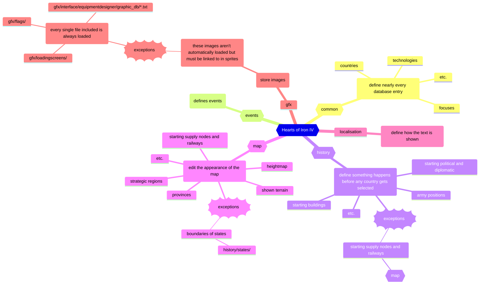

```mermaid
mindmap
	{{Hearts of Iron IV}}
		{{common}}
		::icon(fa fa-book)
			(define nearly every database entry)
			::icon(fa fa-info)
				countries
				technologies
				focuses
				etc.
		{{events}}
		::icon(fa fa-book)
			(defines events)
			::icon(fa fa-info)
		{{history}}
		::icon(fa fa-book)
			(define something happens before any country gets selected)
			::icon(fa fa-info)
				starting political and diplomatic
				army positions
				starting buildings
				etc.
				))exceptions((
				::icon(fa fa-ban forbidden)
					starting supply nodes and railways
						{{map}}
						::icon(fa fa-book)
		{{map}}
		::icon(fa fa-book)
			(edit the appearance of the map)
			::icon(fa fa-info)
				provinces
				shown terrain
				heightmap
				strategic regions
				starting supply nodes and railways
				etc.
				))exceptions((
				::icon(fa fa-ban forbidden)
					boundaries of states
						history/states/
						::icon(fa fa-book)
		localisation
		::icon(fa fa-book)
			(define how the text is shown)
			::icon(fa fa-info)
		gfx
		::icon(fa fa-book)
			(store images)
			::icon(fa fa-info)
				(these images aren't automatically loaded but must be linked to in sprites)
				::icon(fa fa-exclamation-triangle)
					))exceptions((
					::icon(fa fa-ban forbidden)
						(every single file included is always loaded)
						::icon(fa fa-info)
							gfx/loadingscreens/
							::icon(fa fa-book)
							gfx/flags/
							::icon(fa fa-book)
							gfx/interface/equipmentdesigner/graphic_db/*.txt
							::icon(fa fa-book)
```