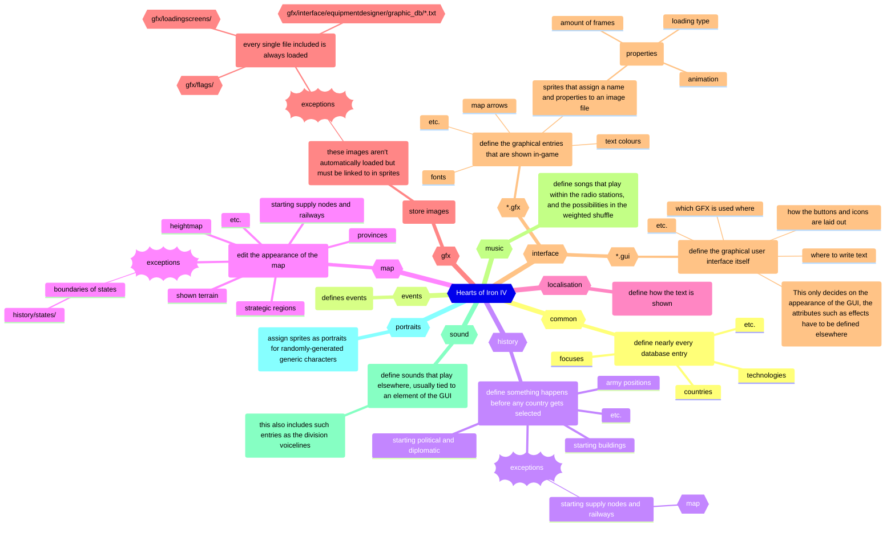

```mermaid
mindmap
	{{Hearts of Iron IV}}
		{{common}}
		::icon(fa fa-book)
			(define nearly every database entry)
			::icon(fa fa-info)
				countries
				technologies
				focuses
				etc.
		{{events}}
		::icon(fa fa-book)
			(defines events)
			::icon(fa fa-info)
		{{history}}
		::icon(fa fa-book)
			(define something happens before any country gets selected)
			::icon(fa fa-info)
				starting political and diplomatic
				army positions
				starting buildings
				etc.
				))exceptions((
				::icon(fa fa-ban forbidden)
					starting supply nodes and railways
						{{map}}
						::icon(fa fa-book)
		{{map}}
		::icon(fa fa-book)
			(edit the appearance of the map)
			::icon(fa fa-info)
				provinces
				shown terrain
				heightmap
				strategic regions
				starting supply nodes and railways
				etc.
				))exceptions((
				::icon(fa fa-ban forbidden)
					boundaries of states
						history/states/
						::icon(fa fa-book)
		{{localisation}}
		::icon(fa fa-book)
			(define how the text is shown)
			::icon(fa fa-info)
		{{gfx}}
		::icon(fa fa-book)
			(store images)
			::icon(fa fa-info)
				(these images aren't automatically loaded but must be linked to in sprites)
				::icon(fa fa-exclamation-triangle)
					))exceptions((
					::icon(fa fa-ban forbidden)
						(every single file included is always loaded)
						::icon(fa fa-info)
							{{gfx/loadingscreens/}}
							::icon(fa fa-book)
							{{gfx/flags/}}
							::icon(fa fa-book)
							{{gfx/interface/equipmentdesigner/graphic_db/*.txt}}
							::icon(fa fa-edit)
		{{interface}}
		::icon(fa fa-book)
			{{*.gfx}}
			::icon(fa fa-edit)
				(define the graphical entries that are shown in-game)
				::icon(fa fa-info)
					sprites that assign a name and properties to an image file
						(properties)
						::icon(fa fa-paperclip)
							animation
							amount of frames
							loading type
					fonts
					text colours
					map arrows
					etc.
			{{*.gui}}
			::icon(fa fa-edit)
				(define the graphical user interface itself)
				::icon(fa fa-info)
					how the buttons and icons are laid out
					which GFX is used where
					where to write text
					etc.
					(This only decides on the appearance of the GUI, the attributes such as effects have to be defined elsewhere)
					::icon(fa fa-exclamation-triangle)
		{{music}}
		::icon(fa fa-book)
			(define songs that play within the radio stations, and the possibilities in the weighted shuffle)
			::icon(fa fa-info)
		{{sound}}
		::icon(fa fa-book)
			(define sounds that play elsewhere, usually tied to an element of the GUI)
			::icon(fa fa-info)
				(this also includes such entries as the division voicelines)
				::icon(fa fa-info)
		{{portraits}}
		::icon(fa fa-book)
			(assign sprites as portraits for randomly-generated generic characters)
			::icon(fa fa-info)
```