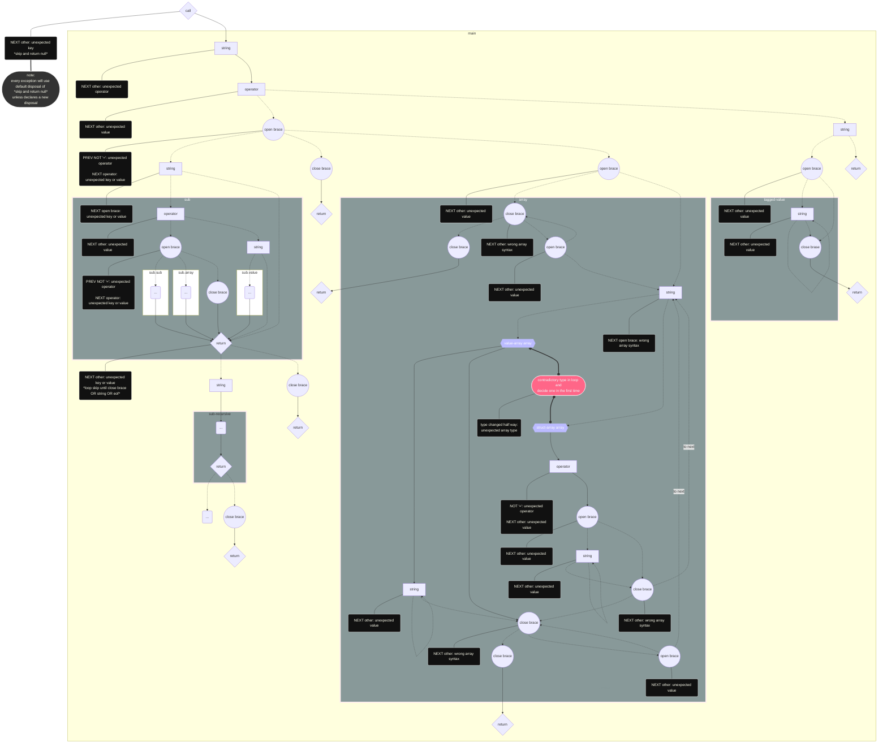

# token type

|         token *as*         |     type     |                                                       *note* |
| :------------------------: | :----------: | -----------------------------------------------------------: |
|             =              |   operator   |                                                              |
|             <              |   operator   |                                                              |
|             >              |   operator   |                                                              |
|             {              |  open brace  |                                                              |
|             }              | close brace  |                                                              |
| utf-8 string without blank |    string    |                              blank for ' ', '\n', '\t', '\r' |
| utf-8 string within quote  |    string    | including escape quote "\\""  utf-8 characters within the quote will encode to Unicode when displaying |
|           empty            | end of chain |                            it is always  included in "other" |
