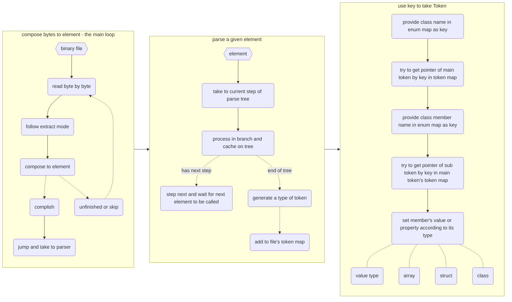
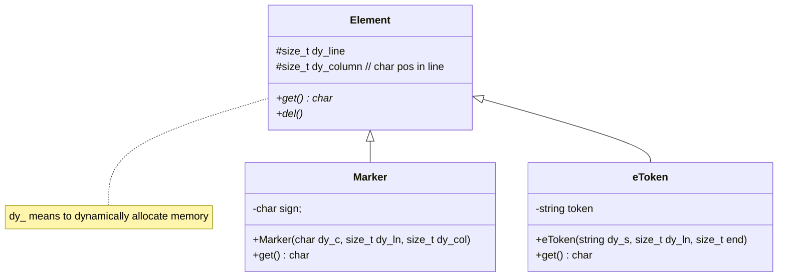
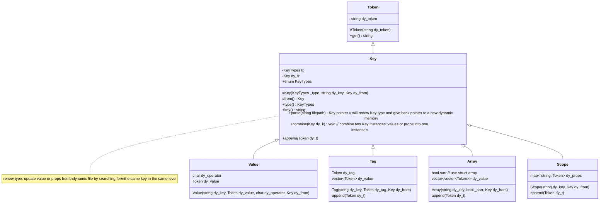
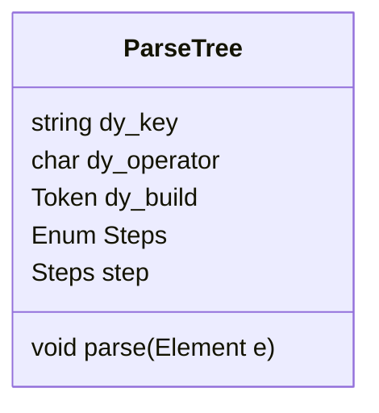
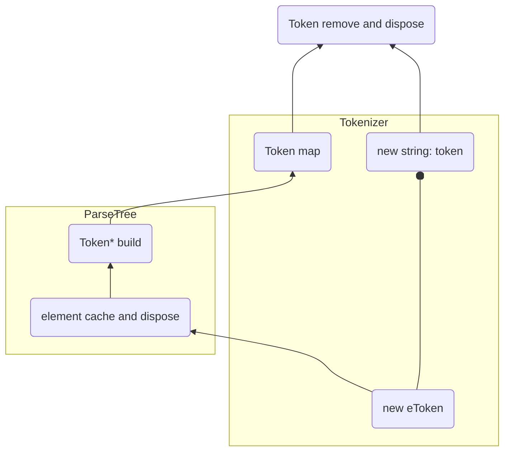
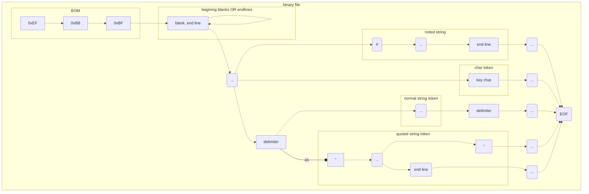

|       compose mode | (multi-byte) type |                                                              |
| -----------------: | :---------------: | ------------------------------------------------------------ |
|                  - |     delimiter     | blank, line end, note, key char, "                           |
|               skip |                   |                                                              |
|                    |       blank       | \t, space, \n, \r                                            |
|                    |     end line      | \n, \r                                                       |
|                    |   noted string    | chars behind # in the same line, except for within quote     |
| compose to  marker |                   |                                                              |
|                    |      marker       | =, >, <, }, {                                                |
|   compose to Token |                   |                                                              |
|                    |   quoted token    | include chars and \\", begin with ", and end with " or end line |
|                    |  unquoted token   | include chars between two delimiters, not noted string       |







type of Token

```
Value
key = subkey

Scope
key = {
	// scope
	subkey = {
		...
	} ...
	
	// value
	subkey ...
}

Tag
key = tag{
	subkey ...
	}
	
Array
key = {
	// value
	{subkey ...}
	// scope
	{subkey = {} ...}
}
```

Token::combine mode

| instance type \| combine type | Value                                                        | Scope                                                        | Tag                                                   | Array                                                        |
| ----------------------------- | ------------------------------------------------------------ | ------------------------------------------------------------ | ----------------------------------------------------- | ------------------------------------------------------------ |
| Value                         | replace subkey to latter's [warn: replacement]               | add subkey to latter's map, skip if subkey exists in the map | ex: incompatible type                                 | ex: incompatible type                                        |
| Scope                         | add latter's subkey to map, skip if subkey exists in the map | combine map elements of both                                 | ex: incompatible type                                 | ex: incompatible type                                        |
| Tag                           | ex: incompatible type                                        | ex: incompatible type                                        | replace tag and value to latter's [warn: replacement] | ex: incompatible type                                        |
| Array                         | ex: incompatible type                                        | ex: incompatible type                                        | ex: incompatible type                                 | only if both type of array same will combine value elements, otherwise ex: incompatible type |





# extract process



scope struct

| type                 | data     |      |
| -------------------- | -------- | ---- |
| Token                | key      |      |
| Token                | operator |      |
| map<string, Token *> | props    |      |
| Token *              | from     |      |
|                      |          |      |
|                      |          |      |

```mermaid
%%graph
	subgraph file
		file.parse(parse)
			--> file.main
		subgraph file.main[token map]
			a
		end
	end

	subgraph main.from = null
		main.parse(parse) 
			-.-> main.entry 
			-.- main.entry.next.omit(...) 
			--> main.rear(null)
		main.entry
			-.-> main.rear
		main.parse
			-.-> ex.main.entry(empty: cannot parse main entry)
		subgraph main.entry
			direction LR
			main.entry.parse(parse)
				-.-> main.entry.entry
				-.- main.entry.entry.next.omit(...)
				--> main.entry.rear(null)
			main.entry.entry
				-.-> main.entry.rear
			main.entry.parse
				-.-> main.entry.empty(empty)
			subgraph main.entry.entry
				direction LR
				main.entry.entry.parse
					-.-> main.entry.entry.empty(empty)
				main.entry.entry.parse(parse)
					-.-> main.entry.entry.omit(...)
			end
		end
	end
```

> attentionally, it can append sub-key's property by using same key elsewhere in the same level and name scope

