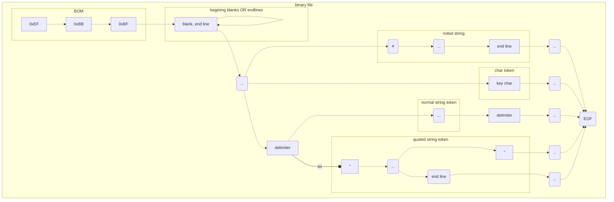

token struct

|   type |  data  |                                     |
| -----: | :----: | ----------------------------------- |
| string | token  |                                     |
| size_t |  line  |                                     |
| size_t | column | start position of token in the line |

| tokenize mode | (multi-byte) char type |                                                              |
| ------------: | :--------------------: | ------------------------------------------------------------ |
|             - |       delimiter        | blank, line end, note, key char, "                           |
|        ignore |                        |                                                              |
|               |         blank          | \t, space                                                    |
|               |        end line        | \n, \r                                                       |
|               |      noted string      | chars behind # in the same line, except for within quote     |
|    char token |                        |                                                              |
|               |        key char        | =, >, <, }, {                                                |
|  string token |                        |                                                              |
|               |     quoted string      | include chars and \\", begin and end with " in the same line |
|               |     normal string      | include chars between two delimiters, not noted string       |

# tokenize process

