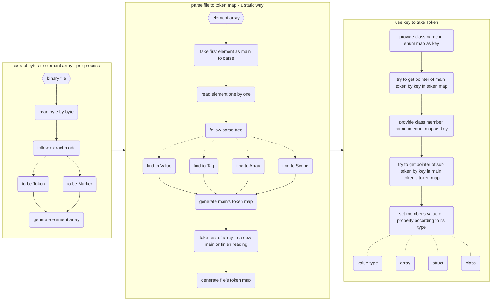
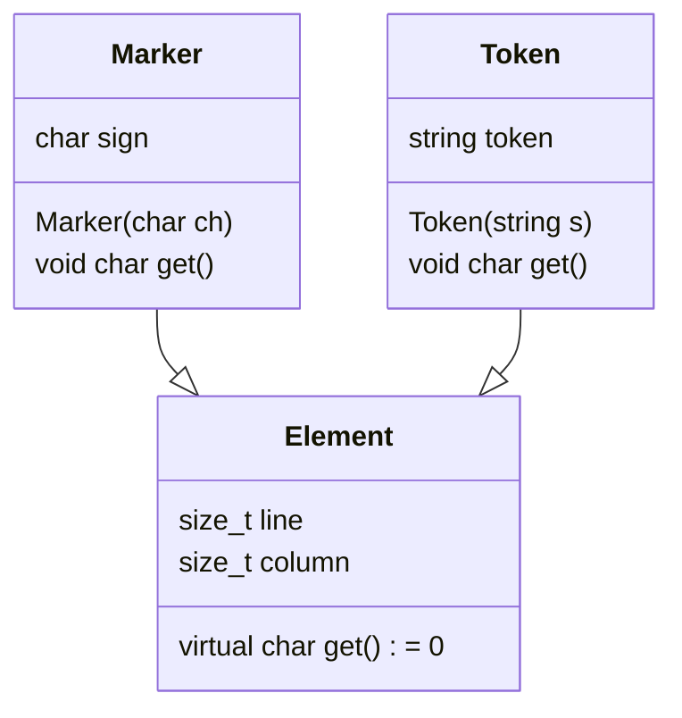
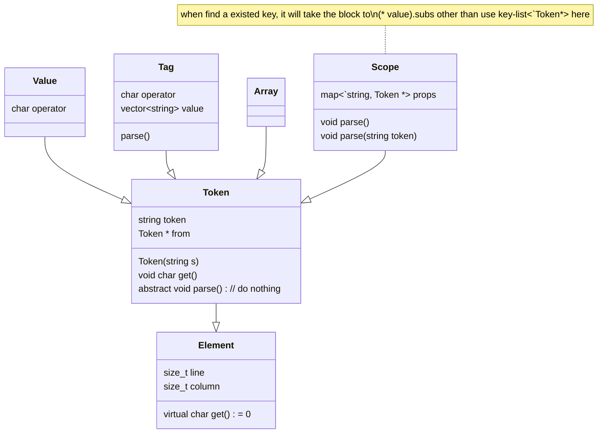

|   extract mode | (multi-byte) type |                                                              |
| -------------: | :---------------: | ------------------------------------------------------------ |
|              - |     delimiter     | blank, line end, note, key char, "                           |
|        abandon |                   |                                                              |
|                |       blank       | \t, space                                                    |
|                |     end line      | \n, \r                                                       |
|                |   noted string    | chars behind # in the same line, except for within quote     |
| keep as marker |                   |                                                              |
|                |      marker       | =, >, <, }, {                                                |
| keep  as Token |                   |                                                              |
|                |   quoted token    | include chars and \\", begin with ", and end with " or end line |
|                |  unquoted token   | include chars between two delimiters, not noted string       |



```c++
char Marker::get()
{
    return sign;
}

char Token::get()
{
    return token[0];
}
```


# extract process


scope struct

| type                 | data     |      |
| -------------------- | -------- | ---- |
| Token                | key      |      |
| Token                | operator |      |
| map<string, Token *> | props    |      |
| Token *              | from     |      |
|                      |          |      |
|                      |          |      |

```mermaid
%%graph
	subgraph file
		file.parse(parse)
			--> file.main
		subgraph file.main[token map]
			a
		end
	end

	subgraph main.from = null
		main.parse(parse) 
			-.-> main.entry 
			-.- main.entry.next.omit(...) 
			--> main.rear(null)
		main.entry
			-.-> main.rear
		main.parse
			-.-> ex.main.entry(empty: cannot parse main entry)
		subgraph main.entry
			direction LR
			main.entry.parse(parse)
				-.-> main.entry.entry
				-.- main.entry.entry.next.omit(...)
				--> main.entry.rear(null)
			main.entry.entry
				-.-> main.entry.rear
			main.entry.parse
				-.-> main.entry.empty(empty)
			subgraph main.entry.entry
				direction LR
				main.entry.entry.parse
					-.-> main.entry.entry.empty(empty)
				main.entry.entry.parse(parse)
					-.-> main.entry.entry.omit(...)
			end
		end
	end
```

> attentionally, it can append sub-key's property by using same key elsewhere in the same level and name scope

