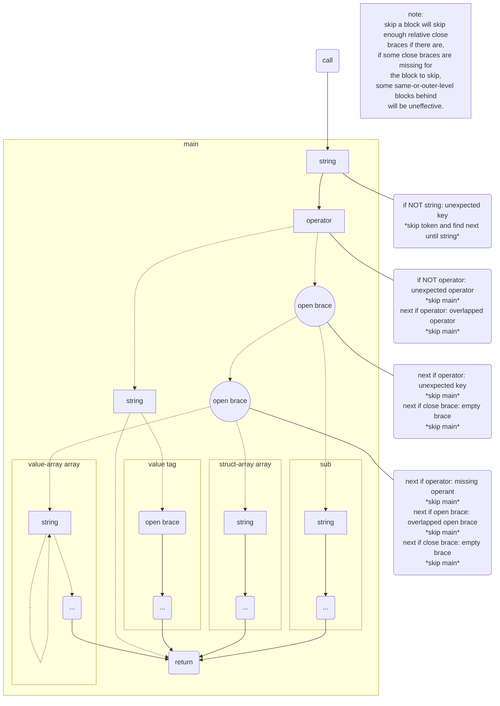

```mermaid
graph
	main.call(call) --> main.key[string]
	subgraph main
		main.key --> main.op[operator]
	end

	%% value
	subgraph main
		main.op -.-> main.value[string]
		main.value -.-> main.return(return)
	end

	%% value tag
	main.value -.-> main.value.openb(open brace)
	subgraph main
		subgraph value tag
			main.value.openb --> main.value.tag.omit(...)
		end
	main.value.tag.omit --> main.return
	end

	%% array
	subgraph main
		main.op -.-> main.openb((open brace))
		main.openb -.-> main.array.openb((open brace))
	end

	%% value-array array
	subgraph main
		subgraph value-array array
			main.array.openb -.-> varr.ele[string]
			varr.ele -.-> varr.ele 
			varr.ele -.-> varr.omit(...)
		end
	varr.omit --> main.return
	end

	%% struct-array array
	subgraph main
		subgraph struct-array array
			main.array.openb -.-> sarr.ele.key[string]
			sarr.ele.key --> sarr.omit(...)
		end
	sarr.omit --> main.return
	end
	
	%% sub
	subgraph main
		subgraph sub
			main.openb -.-> sub.key[string]
			sub.key --> sub.omit(...)
		end
	sub.omit --> main.return
	end


	%% exception
	main.key 
		--- ex.main.key(if NOT string: unexpected key\n*skip token and find next until string*) 
	main.op 
		--- ex.main.op(if NOT operator: unexpected operator\n*skip main*\nnext if operator: overlapped operator\n*skip main*)
	main.openb  
		--- ex.main.openb(next if operator: unexpected key\n*skip main*\nnext if close brace: empty brace\n*skip main*)
	main.array.openb 
		--- ex.main.array.openb(next if operator: missing operant\n*skip main*\nnext if open brace: overlapped open brace\n*skip main*\nnext if close brace: empty brace\n*skip main*)
	
	%% note
	note.skip[note:\nskip a block will skip enough relative close\nbraces if there are,\nif some close braces are missing for\nthe block to skip,\nsome same-or-outer-level blocks behind\nwill be uneffective.]
	
```
