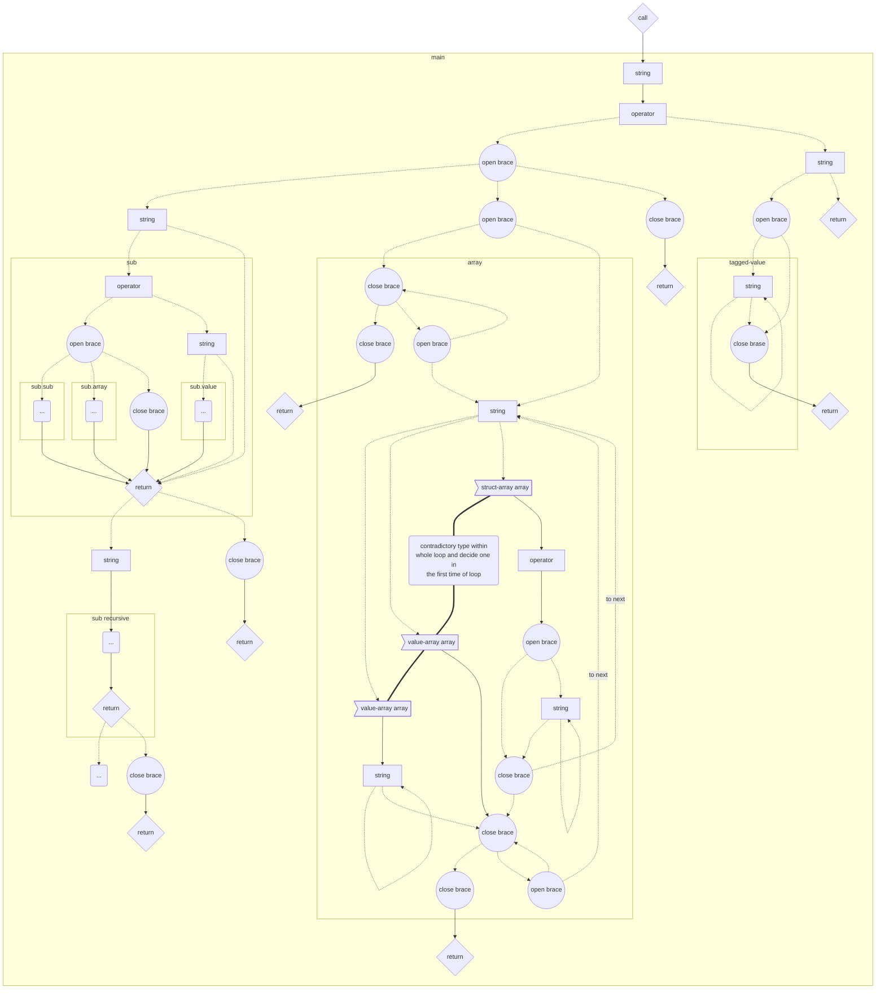

```mermaid
graph 
	main.begin{call} --> main.key[string]
	subgraph main
		main.key --> main.op[operator]
	end

	%% value
	subgraph main
		main.op -.-> main.openb((open brace))
		main.openb -.-> sub.key[string]
		main.openb -.-> main.array.openb((open brace))
		
		main.openb -.-> main.closeb((close brace)) 
		main.closeb((close brace)) --> main.closeb.return{return}
		
		main.op -.-> main.value_t[string]
		main.value_t -.-> main.value_t.openb((open brace))
		main.value_t -.-> main.value_t.return{return}
	end

	%% value tag
	subgraph main
		subgraph tagged-value
			main.value_t.openb -.-> main.value_t.value[string]
			main.value_t.openb -.-> main.value_t.closeb

			main.value_t.value -.-> main.value_t.value
			main.value_t.value -.-> main.value_t.closeb((close brase))
		end
		main.value_t.closeb --> main.value_t.value.return{return}
	end
	
	%% value-array array OR struct-array array
	subgraph main
		subgraph array
			main.array.openb -.-> main.array.ele.closeb((close brace))
			main.array.openb -.-> main.array.ele[string]
			
			main.array.ele.closeb -.-> main.array.closeb((close brace))
			main.array.ele.closeb((close brace)) -.-> main.array.ele.openb((open brace))
		
			main.array.ele.openb -.-> main.array.ele.closeb
			main.array.ele.openb -.-> main.array.ele
			
			sarr 
				=== ex.main.arraytype(contradictory type within\nwhole loop and decide one in\nthe first time of loop)
				=== varr2
				=== varr1
			main.array.ele -.-> varr1>value-array array]
				--> varr.ele[string]
				-.-> varr.ele
				-.-> vsarr.ele.closeb
			main.array.ele -.-> varr2>value-array array] 
				--> vsarr.ele.closeb
			main.array.ele -.-> sarr>struct-array array] 
				--> vsarr.ele.op[operator]
			
			vsarr.ele.op --> vsarr.ele.value.openb((open brace))
			
			vsarr.ele.value.openb -.-> vsarr.ele.value.closeb
			vsarr.ele.value.openb -.-> vsarr.ele.key.value[string]
	
			
			vsarr.ele.key.value -.-> vsarr.ele.value.closeb((close brace))
			vsarr.ele.key.value -.-> vsarr.ele.key.value

			vsarr.ele.value.closeb -.-> vsarr.ele.closeb((close brace))
			vsarr.ele.value.closeb -.-> |to next| main.array.ele
			
			vsarr.ele.closeb -.-> vsarr.closeb((close brace))
			
			vsarr.ele.closeb -.-> vsarr.ele.openb((open brace))
			vsarr.ele.openb -.-> vsarr.ele.closeb
			vsarr.ele.openb -.-> |to next| main.array.ele
		end
		main.array.closeb --> main.array.closeb.return{return}
		vsarr.closeb --> main.vsarr.return{return}
	end

	%% sub
	subgraph main
		subgraph sub
			sub.key -.-> sub.op[operator]
			sub.key -.-> sub.return
			
			sub.op -.-> sub.openb((open brace))
			sub.op -.-> sub.value.key[string]
			
			sub.value.key -.-> sub.value.omit(...)
			sub.value.omit --> sub.return
			sub.value.key -.-> sub.return
			subgraph sub.value
				sub.value.omit
			end

			sub.openb -.-> sub.sub.omit(...)
			sub.sub.omit --> sub.return
			subgraph sub.sub
				sub.sub.omit
			end

			sub.openb -.-> sub.array.omit(...)
			sub.array.omit --> sub.return{return}
			subgraph sub.array
				sub.array.omit
			end
			sub.openb -.-> sub.openb.c((close brace)) --> sub.return
		end
		sub.return -.-> subr.key[string]
		sub.return -.-> sub.closeb((close brace))
		sub.closeb --> main.sub.return{return}
	end
	
	%% sub recursive
	subgraph main
		subgraph sub recursive
			subr.key --> subr.key.omit(...) --> subr.return{return}
		end
		subr.return -.-> subr.omit(...)
		
		subr.return -.-> subr.closeb((close brace))
		subr.closeb --> main.subr.return{return}
	end
```

