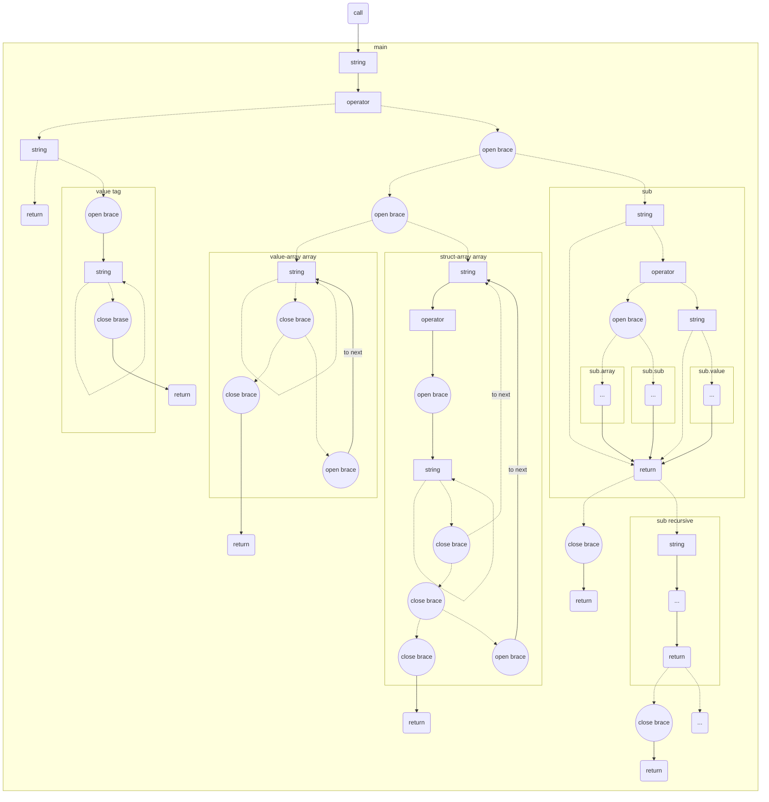

```mermaid
graph
    main.call(call) --> main.key[string]
    subgraph main
        main.key --> main.op[operator]
    end

    %% value
    subgraph main
        main.op -.-> main.value[string]
        main.value -.-> main.value.return(return)
    end

    %% value tag
    subgraph main
        main.value -.-> main.value.openb((open brace))
        subgraph value tag
            
            main.value.openb --> main.value.tag[string]

            main.value.tag -.-> main.value.tag
            main.value.tag -.-> main.value.closeb((close brase))
        end
        main.value.closeb --> main.value.tag.return(return)
    end

    %% array
    subgraph main
        main.op -.-> main.openb((open brace))
        main.openb -.-> main.array.openb((open brace))
    end

    %% value-array array
    subgraph main
        subgraph value-array array
            main.array.openb -.-> varr.ele[string]

            varr.ele -.->varr.ele
            varr.ele -.-> varr.ele.closeb((close brace))

            varr.ele.closeb -.-> varr.closeb((close brace))
            varr.ele.closeb -.-> varr.ele.openb((open brace))

            varr.ele.openb ----> |to next| varr.ele
        end
        varr.closeb ---> main.varr.return(return)
    end

    %% struct-array array
    subgraph main
        subgraph struct-array array
            main.array.openb -.-> sarr.ele.key[string]
            sarr.ele.key --> sarr.ele.op[operator]
            sarr.ele.op --> sarr.ele.value.openb((open brace))
            sarr.ele.value.openb --> sarr.ele.value.key[string]

            sarr.ele.value.key -.-> sarr.ele.value.key
            sarr.ele.value.key -.-> sarr.ele.value.closeb((close brace))

            sarr.ele.value.closeb -.-> |to next| sarr.ele.key
            sarr.ele.value.closeb -.-> sarr.ele.closeb((close brace))

            sarr.ele.closeb -.-> sarr.closeb((close brace))
            sarr.ele.closeb -.-> sarr.ele.openb((open brace))

            sarr.ele.openb --> |to next| sarr.ele.key
        end
        sarr.closeb --> main.sarr.return(return)
    end

    %% sub
    subgraph main
        subgraph sub
            main.openb -.-> sub.key[string]
            sub.key -.-> sub.return
            sub.key -.-> sub.op[operator]
            sub.op -.-> sub.openb((open brace))

            sub.op -.-> sub.value.key[string]
            sub.value.key -.-> sub.return
            sub.value.key -.-> sub.value.omit(...)
            sub.value.omit --> sub.return

            subgraph sub.value
                sub.value.omit
            end

            sub.openb -.-> sub.array.omit(...)
            sub.array.omit --> sub.return(return)
            subgraph sub.array
                sub.array.omit
            end

            sub.openb -.-> sub.sub.omit(...)
            sub.sub.omit --> sub.return
            subgraph sub.sub
                sub.sub.omit
            end
        end
        sub.return -.-> sub.closeb((close brace))
        sub.closeb --> main.sub.return(return)
    end
    
    %% sub recursive
    subgraph main
        sub.return -.-> subr.key[string]
        subgraph sub recursive
            subr.key --> subr.key.omit(...) --> subr.return(return)
        end
        subr.return -.-> subr.closeb((close brace))
        subr.return -.-> subr.omit(...)
        
        subr.closeb --> main.subr.return(return)
    end
```
