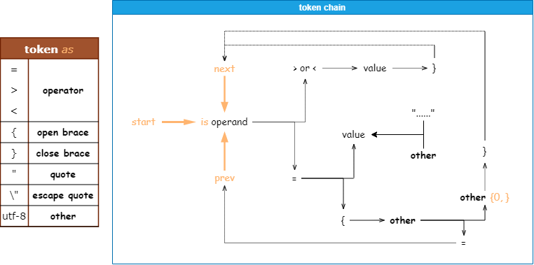

# Read \*.txt, \*.gfx, \*.gui Under "Hearts of Iron IV\\" Using Basic Syntax for Test

>+ Hoi4 Original Game Version 1.12.13
>+ the number of \*.txt is *3693*, \*.gfx is *294*, \*.gui is *414*
>+ [raw exception log](../_test/exception%20log.txt)

<br>

<span id="top"></span>

1. [Basic Syntax](#basic_syntax)
2. [[syntax] '#' Inside Quote](#inside_quote)
3. [[syntax] compound assigned](#compound_as)
4. [[syntax] assigned from struct-array enum](#sarr_enum_as)
5. [[syntax] assigned from value-array enum](#varr_enum_as)
6. [[syntax] assigned from value enum](#value_enum_as)
7. [[syntax] Contains Operant As Quoted-String](#quoted_operant)
8. [[syntax] Contains Escape Quote \"](#escape_quote)
9. [[exception] Unexpected Token](#unexpected_token)
10. [[exception] Missing Close Brace](#missing_closeb)
11. [Nonstandard Hoi4 Script](#nonstandard)

<br>

<span id="basic_syntax"></span>

[^](#top)

## Basic Syntax
> *Also **Tokenize Rule***
>
> 1. read script file byte by byte, if meet '#' skip rest of the line
> 2. *<font color=CornflowerBlue>[loop]</font>* collect bytes for token while next byte is not *blank\**, then skip any *blank* to read next token, and '{' '}' '=', '>', '<', '"', "\\"" are special byte(s) need to be a single token. *\*blank refers to ' ', '\n', '\t', '\r'*
> 3. take a token assumed *operand*, *<font color=CornflowerBlue>[loop]</font>* then read next

| *next token(s)* | IF '{' AND '=' |  | ELSE IF '=' OR '>' OR '<' |  | ELSE |
|---:|:-:|:-:|:-:|:-:|:-:|
|  | IF contains any '=' '>' or '<' | ELSE | *type of value* |  | throw <font color=DarkGreen>***Element name cannot contain blank.*<br>**</font> |
|  | *type of scope* | *type of enum* | IF next non-space byte is '"' | ELSE |  |
|  |  | collect all tokens until found nearest '}' | value is a full-string, collect all tokens in quote, and trans to unicode | value is a string without *blank* |  |
| *note* | if found a '}', pop out once from '{' *stash* |  | if there is any "\\"" in value, throw <font color=DarkGreen>***escape quote.*<br>**</font> |  |  |
>4. if no exception throw, read for next *operand* token, and repeat *Tokenize Rule* over and over again, *<font color=CornflowerBlue>[loop]</font>* until meet the end of the script file
>5. at the end of file, if there is any '{' has not popped out from *stash*\*, throw  <font color=DarkGreen>***Brace is asymmetrical.*<br>**</font> * *stash records the sequence of all '{'*



<br>

<span id="inside_quote"></span>

[^](#top)

## [syntax] '#' Inside Quote


```CS
// such as
web_link = "Land_warfare#Theater"
```

> C:\Program Files\steam\steamapps\common\Hearts of Iron IV\interface\\**tutorialscreen.gui**<br><br>
> *Element name cannot contain blank.*<br>

<br>

## [syntax] Special Assigned

<br>

<span id="compound_as"></span>

[^](#top)

### compound assigned


```CS
// such as
enable_equipments = {
    limit = {
        NOT = { has_dlc = "in Blood Alone" }
    }
    rocket_interceptor_equipment_1
}
```

> Hearts of Iron IV\common\technologies\\**electronic_mechanical_engineering.txt**<br>
> *Element name cannot contain blank.*<br>

<br>

<span id="sarr_enum_as"></span>

[^](#top)

### assigned from struct-array enum


```CS
// such as
colors = {
    { bronze = { 155.0 105.0 87.0 1.0 } silver = { 1.0 1.0 1.0 1.0 } gold = { 0.93 0.74 0.38 1.0 } }
    { bronze = { 155.0 105.0 87.0 1.0 } silver = { 1.0 1.0 1.0 1.0 } gold = { 0.93 0.74 0.38 1.0 } }
    { bronze = { 155.0 105.0 87.0 1.0 } silver = { 1.0 1.0 1.0 1.0 } gold = { 0.93 0.74 0.38 1.0 } }
}
```

> Hearts of Iron IV\common\medals\\**00_medals.txt**<br>
> *Element name cannot contain blank.*<br>

<br>

<span id="varr_enum_as"></span>

[^](#top)

### assigned from value-array enum


```CS
// such as
colors = {
    { 192.0 66.0 66.0 1.0 }
    { 48.0 51.0 60.0 1.0 }
    { 238.0 189.0 96.0 1.0 }
    { 211.0 181.0 128.0 1.0 }
}
```

> Hearts of Iron IV\common\ribbons\\**00_ribbons.txt**<br>
> *Element name cannot contain blank.*<br>

<br>

<span id="value_enum_as"></span>

[^](#top)

### assigned from value enum


```CS
// such as
color = rgb { 0 0 0 }
```

> Hearts of Iron IV\common\countries\\**Afar.txt**<br>
> *Element name cannot contain blank.*<br>
> Hearts of Iron IV\common\countries\\**Algeria.txt**<br>
> *Element name cannot contain blank.*<br>
> Hearts of Iron IV\common\countries\\**Andalusia.txt**<br>
> *Element name cannot contain blank.*<br>
> Hearts of Iron IV\common\countries\\**Bahamas.txt**<br>
> *Element name cannot contain blank.*<br>
> Hearts of Iron IV\common\countries\\**Bangladesh.txt**<br>
> *Element name cannot contain blank.*<br>
> Hearts of Iron IV\common\countries\\**Belize.txt**<br>
> *Element name cannot contain blank.*<br>
> Hearts of Iron IV\common\countries\\**Benishangul-Gumuz.txt**<br>
> *Element name cannot contain blank.*<br>
> Hearts of Iron IV\common\countries\\**Bosnia.txt**<br>
> *Element name cannot contain blank.*<br>
> Hearts of Iron IV\common\countries\\**British Antilles.txt**<br>
> *Element name cannot contain blank.*<br>
> Hearts of Iron IV\common\countries\\**Brittany.txt**<br>
> *Element name cannot contain blank.*<br>
> Hearts of Iron IV\common\countries\\**Burma.txt**<br>
> *Element name cannot contain blank.*<br>
> Hearts of Iron IV\common\countries\\**Burundi.txt**<br>
> *Element name cannot contain blank.*<br>
> Hearts of Iron IV\common\countries\\**Cameroon.txt**<br>
> *Element name cannot contain blank.*<br>
> Hearts of Iron IV\common\countries\\**Catalonia.txt**<br>
> *Element name cannot contain blank.*<br>
> Hearts of Iron IV\common\countries\\**Cayenne.txt**<br>
> *Element name cannot contain blank.*<br>
> Hearts of Iron IV\common\countries\\**Central African Republic.txt**<br>
> *Element name cannot contain blank.*<br>
> Hearts of Iron IV\common\countries\\**Chad.txt**<br>
> *Element name cannot contain blank.*<br>
> Hearts of Iron IV\common\countries\\**colors.txt**<br>
> *Element name cannot contain blank.*<br>
> Hearts of Iron IV\common\countries\\**Corsica.txt**<br>
> *Element name cannot contain blank.*<br>
> Hearts of Iron IV\common\countries\\**cosmetic.txt**<br>
> *Element name cannot contain blank.*<br>
> Hearts of Iron IV\common\countries\\**Curacao.txt**<br>
> *Element name cannot contain blank.*<br>
> Hearts of Iron IV\common\countries\\**Cyprus.txt**<br>
> *Element name cannot contain blank.*<br>
> Hearts of Iron IV\common\countries\\**Dahomey.txt**<br>
> *Element name cannot contain blank.*<br>
> Hearts of Iron IV\common\countries\\**Danzig.txt**<br>
> *Element name cannot contain blank.*<br>
> Hearts of Iron IV\common\countries\\**Djibouti.txt**<br>
> *Element name cannot contain blank.*<br>
> Hearts of Iron IV\common\countries\\**Don Republic.txt**<br>
> *Element name cannot contain blank.*<br>
> Hearts of Iron IV\common\countries\\**Equatorial Guinea.txt**<br>
> *Element name cannot contain blank.*<br>
> Hearts of Iron IV\common\countries\\**Eritrea.txt**<br>
> *Element name cannot contain blank.*<br>
> Hearts of Iron IV\common\countries\\**Fiji.txt**<br>
> *Element name cannot contain blank.*<br>
> Hearts of Iron IV\common\countries\\**Gabon.txt**<br>
> *Element name cannot contain blank.*<br>
> Hearts of Iron IV\common\countries\\**Galicia.txt**<br>
> *Element name cannot contain blank.*<br>
> Hearts of Iron IV\common\countries\\**Gambela.txt**<br>
> *Element name cannot contain blank.*<br>
> Hearts of Iron IV\common\countries\\**Gambia.txt**<br>
> *Element name cannot contain blank.*<br>
> Hearts of Iron IV\common\countries\\**Ghana.txt**<br>
> *Element name cannot contain blank.*<br>
> Hearts of Iron IV\common\countries\\**Guadeloupe.txt**<br>
> *Element name cannot contain blank.*<br>
> Hearts of Iron IV\common\countries\\**Guam.txt**<br>
> *Element name cannot contain blank.*<br>
> Hearts of Iron IV\common\countries\\**Guinea-Bissau.txt**<br>
> *Element name cannot contain blank.*<br>
> Hearts of Iron IV\common\countries\\**Guinea.txt**<br>
> *Element name cannot contain blank.*<br>
> Hearts of Iron IV\common\countries\\**Guyana.txt**<br>
> *Element name cannot contain blank.*<br>
> Hearts of Iron IV\common\countries\\**Harar.txt**<br>
> *Element name cannot contain blank.*<br>
> Hearts of Iron IV\common\countries\\**Hawaii.txt**<br>
> *Element name cannot contain blank.*<br>
> Hearts of Iron IV\common\countries\\**Herzegovina.txt**<br>
> *Element name cannot contain blank.*<br>
> Hearts of Iron IV\common\countries\\**Ivory Coast.txt**<br>
> *Element name cannot contain blank.*<br>
> Hearts of Iron IV\common\countries\\**Jamaica.txt**<br>
> *Element name cannot contain blank.*<br>
> Hearts of Iron IV\common\countries\\**Kashubia.txt**<br>
> *Element name cannot contain blank.*<br>
> Hearts of Iron IV\common\countries\\**Kosovo.txt**<br>
> *Element name cannot contain blank.*<br>
> Hearts of Iron IV\common\countries\\**Kuban Republic.txt**<br>
> *Element name cannot contain blank.*<br>
> Hearts of Iron IV\common\countries\\**Kurdistan.txt**<br>
> *Element name cannot contain blank.*<br>
> Hearts of Iron IV\common\countries\\**Kuwait.txt**<br>
> *Element name cannot contain blank.*<br>
> Hearts of Iron IV\common\countries\\**Kyrgyzstan.txt**<br>
> *Element name cannot contain blank.*<br>
> Hearts of Iron IV\common\countries\\**Macedonia.txt**<br>
> *Element name cannot contain blank.*<br>
> Hearts of Iron IV\common\countries\\**Madagascar.txt**<br>
> *Element name cannot contain blank.*<br>
> Hearts of Iron IV\common\countries\\**Malawi.txt**<br>
> *Element name cannot contain blank.*<br>
> Hearts of Iron IV\common\countries\\**Maldives.txt**<br>
> *Element name cannot contain blank.*<br>
> Hearts of Iron IV\common\countries\\**Mali.txt**<br>
> *Element name cannot contain blank.*<br>
> Hearts of Iron IV\common\countries\\**Malta.txt**<br>
> *Element name cannot contain blank.*<br>
> Hearts of Iron IV\common\countries\\**Mauritania.txt**<br>
> *Element name cannot contain blank.*<br>
> Hearts of Iron IV\common\countries\\**Micronesia.txt**<br>
> *Element name cannot contain blank.*<br>
> Hearts of Iron IV\common\countries\\**Moldova.txt**<br>
> *Element name cannot contain blank.*<br>
> Hearts of Iron IV\common\countries\\**Morocco.txt**<br>
> *Element name cannot contain blank.*<br>
> Hearts of Iron IV\common\countries\\**Namibia.txt**<br>
> *Element name cannot contain blank.*<br>
> Hearts of Iron IV\common\countries\\**Navarra.txt**<br>
> *Element name cannot contain blank.*<br>
> Hearts of Iron IV\common\countries\\**Niger.txt**<br>
> *Element name cannot contain blank.*<br>
> Hearts of Iron IV\common\countries\\**Nigeria.txt**<br>
> *Element name cannot contain blank.*<br>
> Hearts of Iron IV\common\countries\\**Northern Ireland.txt**<br>
> *Element name cannot contain blank.*<br>
> Hearts of Iron IV\common\countries\\**Occitania.txt**<br>
> *Element name cannot contain blank.*<br>
> Hearts of Iron IV\common\countries\\**Oromo.txt**<br>
> *Element name cannot contain blank.*<br>
> Hearts of Iron IV\common\countries\\**Papua New Guinea.txt**<br>
> *Element name cannot contain blank.*<br>
> Hearts of Iron IV\common\countries\\**Puerto Rico.txt**<br>
> *Element name cannot contain blank.*<br>
> Hearts of Iron IV\common\countries\\**Qatar.txt**<br>
> *Element name cannot contain blank.*<br>
> Hearts of Iron IV\common\countries\\**Qemant.txt**<br>
> *Element name cannot contain blank.*<br>
> Hearts of Iron IV\common\countries\\**Republic of Congo.txt**<br>
> *Element name cannot contain blank.*<br>
> Hearts of Iron IV\common\countries\\**Rif.txt**<br>
> *Element name cannot contain blank.*<br>
> Hearts of Iron IV\common\countries\\**Rwanda.txt**<br>
> *Element name cannot contain blank.*<br>
> Hearts of Iron IV\common\countries\\**Samoa.txt**<br>
> *Element name cannot contain blank.*<br>
> Hearts of Iron IV\common\countries\\**Scotland.txt**<br>
> *Element name cannot contain blank.*<br>
> Hearts of Iron IV\common\countries\\**Senegal.txt**<br>
> *Element name cannot contain blank.*<br>
> Hearts of Iron IV\common\countries\\**Serbia.txt**<br>
> *Element name cannot contain blank.*<br>
> Hearts of Iron IV\common\countries\\**Sidamo.txt**<br>
> *Element name cannot contain blank.*<br>
> Hearts of Iron IV\common\countries\\**Sierra Leone.txt**<br>
> *Element name cannot contain blank.*<br>
> Hearts of Iron IV\common\countries\\**Silesia.txt**<br>
> *Element name cannot contain blank.*<br>
> Hearts of Iron IV\common\countries\\**Slovenia.txt**<br>
> *Element name cannot contain blank.*<br>
> Hearts of Iron IV\common\countries\\**Solomon.txt**<br>
> *Element name cannot contain blank.*<br>
> Hearts of Iron IV\common\countries\\**Somalia.txt**<br>
> *Element name cannot contain blank.*<br>
> Hearts of Iron IV\common\countries\\**South Africa.txt**<br>
> *Element name cannot contain blank.*<br>
> Hearts of Iron IV\common\countries\\**Sri Lanka.txt**<br>
> *Element name cannot contain blank.*<br>
> Hearts of Iron IV\common\countries\\**Sudan.txt**<br>
> *Element name cannot contain blank.*<br>
> Hearts of Iron IV\common\countries\\**Suriname.txt**<br>
> *Element name cannot contain blank.*<br>
> Hearts of Iron IV\common\countries\\**Tahiti.txt**<br>
> *Element name cannot contain blank.*<br>
> Hearts of Iron IV\common\countries\\**Tajikistan.txt**<br>
> *Element name cannot contain blank.*<br>
> Hearts of Iron IV\common\countries\\**Tanzania.txt**<br>
> *Element name cannot contain blank.*<br>
> Hearts of Iron IV\common\countries\\**Tigray.txt**<br>
> *Element name cannot contain blank.*<br>
> Hearts of Iron IV\common\countries\\**Togo.txt**<br>
> *Element name cannot contain blank.*<br>
> Hearts of Iron IV\common\countries\\**Transylvania.txt**<br>
> *Element name cannot contain blank.*<br>
> Hearts of Iron IV\common\countries\\**Trinidad and Tobago.txt**<br>
> *Element name cannot contain blank.*<br>
> Hearts of Iron IV\common\countries\\**Tunisia.txt**<br>
> *Element name cannot contain blank.*<br>
> Hearts of Iron IV\common\countries\\**Turkmenistan.txt**<br>
> *Element name cannot contain blank.*<br>
> Hearts of Iron IV\common\countries\\**Uganda.txt**<br>
> *Element name cannot contain blank.*<br>
> Hearts of Iron IV\common\countries\\**United Arab Emirates.txt**<br>
> *Element name cannot contain blank.*<br>
> Hearts of Iron IV\common\countries\\**Upper Volta.txt**<br>
> *Element name cannot contain blank.*<br>
> Hearts of Iron IV\common\countries\\**Uzbekistan.txt**<br>
> *Element name cannot contain blank.*<br>
> Hearts of Iron IV\common\countries\\**Wales.txt**<br>
> *Element name cannot contain blank.*<br>
> Hearts of Iron IV\common\countries\\**Western Sahara.txt**<br>
> *Element name cannot contain blank.*<br>
> Hearts of Iron IV\common\countries\\**Zambia.txt**<br>
> *Element name cannot contain blank.*<br>

<br>

<span id="quoted_operant"></span>

[^](#top)

## [syntax] Contains Operant As Quoted-String


```CS
// such as
"HMS Furious"= {
```

> Hearts of Iron IV\history\units\\**ENG_1936_air_bba.txt**<br>
> *Element name cannot contain blank.*<br>
> Hearts of Iron IV\history\units\\**ENG_1936_air_legacy.txt**<br>
> *Element name cannot contain blank.*<br>
> Hearts of Iron IV\history\units\\**ENG_1939_air_bba.txt**<br>
> *Element name cannot contain blank.*<br>
> Hearts of Iron IV\history\units\\**ENG_1939_air_legacy.txt**<br>
> *Element name cannot contain blank.*<br>
> Hearts of Iron IV\history\units\\**USA_1936_air_bba.txt**<br>
> *Element name cannot contain blank.*<br>
> Hearts of Iron IV\history\units\\**USA_1936_air_legacy.txt**<br>
> *Element name cannot contain blank.*<br>
> Hearts of Iron IV\history\units\\**USA_1939_air_bba.txt**<br>
> *Element name cannot contain blank.*<br>
> Hearts of Iron IV\history\units\\**USA_1939_air_legacy.txt**<br>
> *Element name cannot contain blank.*<br>

<br>

<span id="escape_quote"></span>

[^](#top)

## [syntax] Contains Escape Quote \\"


> Hearts of Iron IV\events\\**BBA_Ethiopia.txt**<br>
> *escape quote.*<br>
> Hearts of Iron IV\events\\**BBA_ItaloEthiopianWar.txt**<br>
> *escape quote.*<br>
> Hearts of Iron IV\events\\**LAR_occupation.txt**<br>
> *escape quote.*<br>
> Hearts of Iron IV\events\\**LAR_Spain.txt**<br>
> *escape quote.*<br>
> Hearts of Iron IV\events\\**Mexico.txt**<br>
> *escape quote.*<br>
> Hearts of Iron IV\events\\**MTG_Britain.txt**<br>
> *escape quote.*<br>
> Hearts of Iron IV\events\\**MTG_Netherlands.txt**<br>
> *escape quote.*<br>
> Hearts of Iron IV\events\\**MTG_USA.txt**<br>
> *escape quote.*<br>
> Hearts of Iron IV\events\\**NSB_Baltic.txt**<br>
> *escape quote.*<br>
> Hearts of Iron IV\events\\**NSB_Soviet.txt**<br>
> *escape quote.*<br>
> Hearts of Iron IV\events\\**ss_recruitment_event.txt**<br>
> *escape quote.*<br>
> Hearts of Iron IV\events\\**TestEvents.txt**<br>
> *escape quote.*<br>
> Hearts of Iron IV\events\\**TFV_Raj.txt**<br>
> *escape quote.*<br>
> Hearts of Iron IV\events\\**WTT_Japan.txt**<br>
> *escape quote.*<br>


> Hearts of Iron IV\common\decisions\\**BALTIC.txt**<br>
> *escape quote.*<br>
> Hearts of Iron IV\common\decisions\\**BUL.txt**<br>
> *escape quote.*<br>
> Hearts of Iron IV\common\decisions\\**ETH.txt**<br>
> *escape quote.*<br>
> Hearts of Iron IV\common\decisions\\**FRA.txt**<br>
> *escape quote.*<br>
> Hearts of Iron IV\common\decisions\\**ITA.txt**<br>
> *escape quote.*<br>
> Hearts of Iron IV\common\decisions\\**MAN_decisions.txt**<br>
> *escape quote.*<br>
> Hearts of Iron IV\common\decisions\\**POL.txt**<br>
> *escape quote.*<br>
> Hearts of Iron IV\common\decisions\\**SOV.txt**<br>
> *escape quote.*<br>
> Hearts of Iron IV\common\decisions\\**SPR.txt**<br>
> *escape quote.*<br>
> Hearts of Iron IV\common\decisions\\**USA.txt**<br>
> *escape quote.*<br>
> Hearts of Iron IV\common\decisions\\**YUG.txt**<br>
> *escape quote.*<br>


> Hearts of Iron IV\common\national_focus\\**baltic_shared.txt**<br>
> *escape quote.*<br>
> Hearts of Iron IV\common\national_focus\\**china_shared.txt**<br>
> *escape quote.*<br>
> Hearts of Iron IV\common\national_focus\\**estonia.txt**<br>
> *escape quote.*<br>
> Hearts of Iron IV\common\national_focus\\**ethiopia.txt**<br>
> *escape quote.*<br>
> Hearts of Iron IV\common\national_focus\\**france.txt**<br>
> *escape quote.*<br>
> Hearts of Iron IV\common\national_focus\\**free_france.txt**<br>
> *escape quote.*<br>
> Hearts of Iron IV\common\national_focus\\**horn_of_africa.txt**<br>
> *escape quote.*<br>
> Hearts of Iron IV\common\national_focus\\**hungary.txt**<br>
> *escape quote.*<br>
> Hearts of Iron IV\common\national_focus\\**india.txt**<br>
> *escape quote.*<br>
> Hearts of Iron IV\common\national_focus\\**italy.txt**<br>
> *escape quote.*<br>
> Hearts of Iron IV\common\national_focus\\**japan.txt**<br>
> *escape quote.*<br>
> Hearts of Iron IV\common\national_focus\\**latvia.txt**<br>
> *escape quote.*<br>
> Hearts of Iron IV\common\national_focus\\**lithuania.txt**<br>
> *escape quote.*<br>
> Hearts of Iron IV\common\national_focus\\**manchukuo.txt**<br>
> *escape quote.*<br>
> Hearts of Iron IV\common\national_focus\\**mexico.txt**<br>
> *escape quote.*<br>
> Hearts of Iron IV\common\national_focus\\**netherlands.txt**<br>
> *escape quote.*<br>
> Hearts of Iron IV\common\national_focus\\**new_zealand.txt**<br>
> *escape quote.*<br>
> Hearts of Iron IV\common\national_focus\\**poland.txt**<br>
> *escape quote.*<br>
> Hearts of Iron IV\common\national_focus\\**romania.txt**<br>
> *escape quote.*<br>
> Hearts of Iron IV\common\national_focus\\**soviet.txt**<br>
> *escape quote.*<br>
> Hearts of Iron IV\common\national_focus\\**spain.txt**<br>
> *escape quote.*<br>
> Hearts of Iron IV\common\national_focus\\**switzerland.txt**<br>
> *escape quote.*<br>
> Hearts of Iron IV\common\national_focus\\**yugoslavia.txt**<br>
> *escape quote.*<br>
> Hearts of Iron IV\common\on_actions\\**05_lar_on_actions.txt**<br>
> *escape quote.*<br>
> Hearts of Iron IV\common\operations\\**00_operations.txt**<br>
> *escape quote.*<br>
> Hearts of Iron IV\common\operations\\**POL_historical_operations.txt**<br>
> *escape quote.*<br>


> Hearts of Iron IV\common\scripted_effects\\**00_scripted_effects.txt**<br>
> *escape quote.*<br>
> Hearts of Iron IV\common\scripted_effects\\**BUL_scripted_effects.txt**<br>
> *escape quote.*<br>
> Hearts of Iron IV\common\scripted_effects\\**ETH_scripted_effects.txt**<br>
> *escape quote.*<br>
> Hearts of Iron IV\common\scripted_effects\\**ITA_scripted_effects.txt**<br>
> *escape quote.*<br>
> Hearts of Iron IV\common\scripted_effects\\**POL_scripted_effects.txt**<br>
> *escape quote.*<br>
> Hearts of Iron IV\common\scripted_effects\\**PRC_scripted_effects.txt**<br>
> *escape quote.*<br>
> Hearts of Iron IV\common\scripted_effects\\**SOV_scripted_effects.txt**<br>
> *escape quote.*<br>
> Hearts of Iron IV\common\scripted_effects\\**USA_scripted_effects.txt**<br>
> *escape quote.*<br>
> Hearts of Iron IV\common\scripted_effects\\**zz_debug_effects.txt**<br>
> *escape quote.*<br>

<br>

<span id="unexpected_token"></span>

[^](#top)

## [exception] Unexpected Token


```CS
//
// SWE_1939_naval_legacy.txt
//
pride_of_the_fleet = yes definition definition = heavy
// unexpected token of "definition" in line 17
// this line is similar in SWE_1936_naval_legacy.txt but syntax good
```

> Hearts of Iron IV\history\units\\**SWE_1939_naval_legacy.txt**<br>
> *Element name cannot contain blank.*<br>

```CS
//
// core.gfx
//
effectFile = "gfx/FX/buttonstate.lua";
// unexpected token of ";" in line 1735
```

> Hearts of Iron IV\interface\\**core.gfx**<br>
> *Element name cannot contain blank.*<br>

<br>

<span id="missing_closeb"></span>

[^](#top)

## [exception] Missing Close Brace


> *missing for **idea** bolck at the end of file*<br>
> Hearts of Iron IV\common\ideas\\**SOV.txt**<br>
> *Brace is asymmetrical.*<br>
> Hearts of Iron IV\common\ideas\\**switzerland.txt**<br>
> *Brace is asymmetrical.*<br>


> *missing for **objectTypes** bolck at the end of file*<br>
> Hearts of Iron IV\gfx\entities\\**empty.gfx**<br>
> *Brace is asymmetrical.*<br>


> *missing for **1939 start** block at the end of file*<br>
> Hearts of Iron IV\history\countries\\**NOR - Norway.txt**<br>
> *Brace is asymmetrical.*<br>


> *missing for **instant_effect** block at the end of file*<br>
> Hearts of Iron IV\history\units\\**FRA_1936.txt**<br>
> *Brace is asymmetrical.*<br>
> Hearts of Iron IV\history\units\\**FRA_1936_nsb.txt**<br>
> *Brace is asymmetrical.*<br>


> *missing for **BRA_GAR_01** block at the end of file*<br>
> Hearts of Iron IV\common\units\names_divisions\\**BRA_names_divisions.txt**<br>
> *Brace is asymmetrical.*<br>


> *missing for **spriteTypes** block at the end of file*<br>
> Hearts of Iron IV\dlc\dlc029_allied_armor_pack\interface\\**aap_technologies.gfx**<br>
> *Brace is asymmetrical.*<br>


> *missing for **objectTypes** block at the end of file*<br>
> Hearts of Iron IV\dlc\dlc031_battle_for_the_bosporus\gfx\entities\\**_BfB_meshes_infantry.gfx**<br>
> *Brace is asymmetrical.*<br>


> *missing for **guiTypes** block at the end of file*<br>
> Hearts of Iron IV\interface\\**backend.gui**<br>
> *Brace signs are asymmetrical.*<br>


> *missing for **guiTypes** block at the end of file*<br>
> Hearts of Iron IV\interface\\**sov_propaganda_campaigns_scripted_gui.gui**<br>
> *Brace signs are asymmetrical.*<br>

<br>

<span id="nonstandard"></span>

[^](#top)

## Nonstandard Hoi4 Script


> Hearts of Iron IV\\**changelog.txt**<br>
> *Element name cannot contain blank.*<br>
> Hearts of Iron IV\\**checksum_manifest.txt**<br>
> *Element name cannot contain blank.*<br>
> Hearts of Iron IV\\**console_history.txt**<br>
> *Element name cannot contain blank.*<br>
> Hearts of Iron IV\\**licenses.txt**<br>
> *Element name cannot contain blank.*<br>
> Hearts of Iron IV\\**ThirdPartyLicenses.txt**<br>
> *Element name cannot contain blank.*<br>
> Hearts of Iron IV\\**unit_test.txt**<br>
> *Element name cannot contain blank.*<br>


> Hearts of Iron IV\interface\\**credits.txt**<br>
> *Element name cannot contain blank.*<br>


> Hearts of Iron IV\localisation\\**ignored_loc_keys.txt**<br>
> *Element name cannot contain blank.*<br>


> Hearts of Iron IV\map\\**buildings.txt**<br>
> *Element name cannot contain blank.*<br>
> Hearts of Iron IV\map\\**railways.txt**<br>
> *Element name cannot contain blank.*<br>
> Hearts of Iron IV\map\\**supply_nodes.txt**<br>
> *Element name cannot contain blank.*<br>
> Hearts of Iron IV\map\\**unitstacks.txt**<br>
> *Element name cannot contain blank.*<br>
> Hearts of Iron IV\map\\**weatherpositions.txt**<br>
> *Element name cannot contain blank.*<br>


> Hearts of Iron IV\pdx_launcher\\**motd.txt**<br>
> *Element name cannot contain blank.*<br>


> Hearts of Iron IV\previewer_assets\\**previewer_filefilter.txt**<br>
> *Element name cannot contain blank.*<br>


> Hearts of Iron IV\wiki\\**robots.txt**<br>
> *Element name cannot contain blank.*<br>


> Hearts of Iron IV\pdx_launcher\game\\**motd.txt**<br>
> *Element name cannot contain blank.*<br>

[^](#top)
